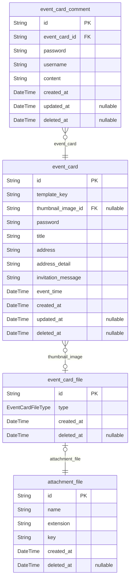

# 띠링

> Generated by [`prisma-markdown`](https://github.com/samchon/prisma-markdown)

- [default](#default)

## default

### `event_card`

이벤트 카드 엔티티

사용자가 생성한 카드 정보입니다.

스타일 정보를 적용하는 템플릿이 연결되어 있으며 사용자가 입력한 정보들을 포함합니다.

카드 관리를 위해서는 `password`가 필요합니다.

**Properties**

- `id`: uuid
- `template_key`: 템플릿 id
- `thumbnail_image_id`: 대표 이미지
- `password`: 관리용 비밀번호
- `title`: 제목
- `address`: 기본 주소
- `address_detail`: 상세 주소
- `invitation_message`: 초대글
- `event_time`: 이벤트 일자
- `created_at`: 생성일자
- `updated_at`: 수정일자
- `deleted_at`: 삭제일자

### `event_card_file`

이벤트 카드 파일 첨부 파일 sub type entity

첨부 파일 엔티티와 1:1 관계

**Properties**

- `id`:
- `type`: 카드내 리소스 유형
- `created_at`: 데이터 추적을 위해 해당 레코드 생성 일자를 기록
- `deleted_at`:

### `event_card_comment`

축하 메시지(방명록) 엔티티

방명록 혹은 축하 메시지가 저장됩니다.

누구나 메시지를 남길 수 있으므로 추후 자신의 메시지를 삭제 혹은 수정하기 위해서 `password`를 사용합니다.

**Properties**

- `id`: uuid
- `event_card_id`: 이벤트 카드 id
- `password`: 관리용 비밀번호
- `username`: 작성자명
- `content`: content
- `created_at`: 생성일자
- `updated_at`: 수정일자
- `deleted_at`: 삭제일자

### `attachment_file`

첨부 파일 엔티티

다양한 첨부 파일 리소스의 메타 정보를 관리하기 위해 만들었습니다.

일반적인 파일명은 `name.extension` 형태입니다.

`key`는 파일 저장소에서 리소스를 찾기 위한 식별자입니다.

**Properties**

- `id`: uuid
- `name`: image.png 에서 `image` 부분입니다.
- `extension`: image.png 에서 `png` 부분입니다.
- `key`: 파일 저장소 내에 실제 리소스의 위치를 나타내는 정보입니다.
- `created_at`: 생성일자
- `deleted_at`: 삭제일자
